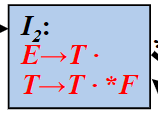
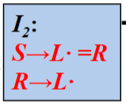

## 5.1 自底向上的语法分析概述

从分析树的底部向顶部方向构造分析树。

自顶向下对应的是最左推导
自底向上对应的是最左规约（规范规约），反向构造最右推导

使用的语法分析框架是移入归约分析，工作过程：
不断地将输入序列移入语法分析栈，若栈顶出现了某产生式的右部，则进行规约。直到遇到错误或栈中包含了开始符号且缓冲区为空（正确接受）。

栈内符号串+剩余输入=“规范句型”：

移入归约分析器的四种动作：移入、归约、接收、报错

移入归约分析中存在的问题：错误地识别了句柄，栈顶可能出现了两个产生式右部，进行了错误的归约。

比如，下图右边的栈顶有两种规约方式可选，分别可以选择左边文法的2和3：

直接短语一定是某个产生式的右部。但产生式的右部不一定是当前句型的直接短语

句柄是句型的最左直接短语（高度为2的子树的边缘？）问题就在于如何**正确地识别句柄**。

## 5.3 LR分析法（状态法）

规约项目，不论输入是什么，都需要归约。

LR分析法是**无回溯**的移进-规约分析方法；几乎所有描述程序设计语言的上下文无关文法，都能构造LR语法分析器；可以用LR方法分析的文法类是可以用LL法分析的文法类的**真超集**。

### 5.3.1 LR(k)分析法：

L：指从左到右扫描输入符号；
R：反向构造最右推导，即最左规约；
k：超前读入k个符号，以确定规约用的产生式(啥时候归约、怎样归约)。

思想：分析器根据当前状态，至多**向前查看k个输入符号，就可以确定是否找到了句柄**。若找到句柄，则可规约；若未找到句柄，则移进输入符号。移进和归约的过程中伴随着状态的转移。

句柄是逐步形成的，“状态”可以表示句柄识别的进展程度。

**LR语法分析器的总体结构：**

结构如下图所示，工作流程为：分析程序从输入缓冲区中读入符号，根据分析表查询应该执行的操作，更新状态/符号栈。

所有LR分析器(LR(0)、SLR(1)、LR(1)、LALR(1))的主控程序、执行逻辑都是一样的，不同的语法分析器具有不同的**分析表**，分析表是LR分析法的核心。

**LR分析器的工作过程：**

1、初始化：$S_0\#\ \ \ \  a_1a_2\dots a_n\#$

2、一般情况下，假设分析器格局如下：$S_0S_1\dots S_m\#X_1\dots X_m\ \ \ \  a_ia_{i+1}\dots a_n\#$

* 如果$action[S_m, a_i] = sj(移入j)$，将格局变为：$S_0S_1\dots S_mj\#X_1\dots X_ma_i\ \ \ \  a_{i+1}\dots a_n\#$。即移入符号以及状态。

* 如果$action[S_m, a_i] = rj(归约j)$，将格局变为：$S_0S_1\dots S_{m-1}\#X_1\dots X_mA\ \ \ \  a_ia_{i+1}\dots a_n\#$。

  查goto表，如果$goto[s_{m-1},A]=K$，将格局变为：$S_0S_1\dots S_{m-1}K\#X_1\dots X_mA\ \ \ \  a_ia_{i+1}\dots a_n\#$

  即规约后，将和被归约的符号数量相等的状态出栈（例如将三个符号归约为A—>abc，就将三个状态出栈），并且使用出栈完的栈再执行一次查goto表，若goto成功则将那个状态压栈。

* 如果$action[S_m, a_i] = acc$，分析成功

* 如果$action[S_m, a_i] = err$，出现语法错误

举例如下，下面是分析表以及依据此分析表进行语法分析的详细过程：

### 5.3.2 LR(0)分析表的构造

思想：使用自动机维护一些状态，这些状态记录和追踪句柄形成的进程，句柄形成即归约。

LR(0)项目：右部某个位置标有圆点的产生式，称为LR(0)项目。若产生式的右部有n个符号，其对应的LR(0)项有n+1个。

例子：对于产生式S➡bBB，其各项目为：

* 归约项目：S→bBB.
* 移进项目：S→.bBB
* 待约项目：S→b.BB、S→bB.B
* 接受项目：若S是开始符号，S→aBB.

自动机的状态是LR(0)项目的集合，使用LR(0)项目表示句柄的形成进度。

**LR(0)自动机：**
$$
M=(Q,\Sigma,\sigma,q_0,F)
$$
**增广文法：**

文法$G=(V, T, P, S)$的增广文法为$G'=(V \cup {S'}, T, P \cup \{S'→S\}, S'), S'\notin V$

增广文法就是在原文法上加上新符号$S'$和产生式$S'→S$。引入这个新开始符号的目的是，使得文法开始符号**仅出现在一个产生式的左部**，从而使得语法分析器只有一个接收状态。

* 初始项目：$S'→.S$
* 接受项目：$S'→S.$

下面要构造状态和状态转移函数（两个）：
将等价的项目组成一个项目集，成为项目集闭包，每个项目集闭包对应自动机的一个状态。

使用**闭包**计算等价的项目：${\rm CLOSURE(I)}=I\cup\{B→.\gamma|A→\alpha.B\beta\in I,B→\gamma\in P\}$，B是非终结符。也就是把已有的项目的右部中的点后面的非终结符都展开，一直迭代展开到不能展开为止。
**状态转换函数**为：${\rm GO(I)}={\rm CLOSURE}\{B→.\gamma|A→\alpha.B\beta\in I,B→\gamma\in P\}$。即不同状态间，使用的是点后面的符号进行转移。

由于将某个状态压入栈时，一定是移入了此状态的入边所对应的符号。又因为给定一个状态，所有入边上标记的符号是相同的，所以可以使用状态代表符号，即**状态和符号一一对应**。

例：

LR(0)确定有穷自动机的形式化定义：$M=(C,V\cup T,GO,I_0,C)$，C是所有的项目集，叫做项目集规范族。

**LR分析表的构造算法：**

1、ACTION[I, a]，I为状态，a为终结符： 

* $A→\alpha.ab\in I$，且GO(I, a)=Ij，那么action[I, a]:=sj
* $A→\alpha.\in I$且此为第j个产生式，对任意的输入符号a，都进行归约
* $S^{'}→S.\in I$，那么action[I, #]:=acc

2、GOTO[I, X]，状态I，非终结符X

* $A→\alpha.X\beta\in I$，且GO(I, X)=Ij，则goto[I, X]:=j

3、其他情况无定义，报错

举例如下，根据自动机构造LR(0)分析表：

若文法G对应的DFA的每个状态都满足这个条件：1、没有移进-归约冲突；2、没有归约-归约冲突，则**此文法是LR(0)文法**。有冲突的例子见PPT。

**规范句型活前缀：**

为什么可以用LR(0)自动机来做出移入-归约决定？TODO-暂时未明白

栈中内容一定是某个最右句型的前缀，称为规范句型活前缀。

根据当前状态I，给定输入符号a，若其在a上没有转移定义，则说明“栈中符号串+a”不再是活前缀，此时应该归约，若没有规约项目则出错。

LR(0)分析能力较差，很多上下文无关文法不能用LR(0)方法进行分析。

### 5.3.3 SLR(1)分析表

移入规约冲突的根本原因：不知道应不应该归约，无法确定当前可归约串是否为句柄。需要更多的信息来判断是否能规约。

解决项目集中冲突的方法：归约时，向前搜索一个输入符号a，若$a\in {\rm FOLLOW(A)}$，则应用A→b.归约，否则移进。

构造SLR(1)分析表，和LR(0)分析表的差别就在于对于归约状态的处理，只有下一个输入符号$a\in {\rm FOLLOW(A)}$，才会用A→b.归约，否则移进。

LR(0)分析表的规约状态，遇到任何一个输入符号，都会采取规约动作
而SLR(1)分析表中，归约状态，只有遇到其FOLLOW集中的元素时，才采取规约动作，否则移入

**一个文法是SLR分析法的要求：**

项目集中的归约项目的非终结符的FOLLOW集两两不相交，移进符号不属于任何一个FOLLOW集。也就是SLR分析表没有冲突。

有冲突的例子（R的FOLLOW集中有等号）：

## 5.3.4 LR(1)分析表的构造

SLR分析法的问题：SLR只是简单的考察了下一个输入符号b是否属于与归约项目$A\rightarrow \alpha$相关联的FOLLOW(A)。但能用此归约项目归约会要求b属于FOLLOW(A)，但b属于FOLLOW(A)不代表就能够归约。理清楚这个逻辑关系。

对于产生式A→a的归约，在不同的使用位置，A会要求不同的后继符号。在特定位置，A的后继符集合是**FOLLOW(A)的子集**。

### 规范LR(1)项目：

形式为$[A\rightarrow \alpha·\beta,a]$，$a$是展望符，表示在当前状态下，A后面必须紧跟的终结符。

* 在项$[A\rightarrow \alpha·\beta,a]，\beta\ne\varepsilon$中，展望符$a$没有任何的作用
* 在项$[A\rightarrow \alpha·,a]$中，只有下一个输入符号为$a$时，才可以按照$A\rightarrow\alpha$进行规约，$a$的集合总是FOLLOW(A)的子集

### LR(1)项目的扩展：

1、GOTO函数：后继项目继承原项目的展望符（后继项目指某一项目进行移入操作后得到的项目）；
2、CLOSURE函数：$[A→\alpha .B\beta,a]$扩展出$[B→.\gamma,b]$，$b\in FIRST(\beta a)$。若$\beta$可以推出空，b=a叫做**继承**的后继符，否则叫**自生**的。

### 构造自动机：

1、$I_0={\rm CLOSURE(\{S^{'}→.S\})}$，构造$C=\{I_0,I_1,\dots,I_n\}$，即文法G'的LR(1)项目集规范族；
2、对于C中每一个项目集：

* 若$[A→\alpha. a\beta,b]\in I_k$且$a$是终结符且GO(I~k~, $a$)=I~j~，那么置action[k, a] := sj;
* if $GO(I_k, B)=I_j$ 且B是非终结符，那么置goto[k, B] := j;
* if $[A→\alpha., a]\in I_k$，且此为第j个产生式，则置action[k, a] := rj;
* 若$[S'→S.,\#]\in I_k$，那么action[k, #] := acc;

若除了展望符外，两个LR(1)项目集是相同的，则称这两个LR(1)项目集是**同心的**。

LR(1)分析表的构造：相比于LR(0)，只有**归约动作**有变化。

若LR(1)分析表没有语法分析动作冲突，那么给定的文法就是LR(1)文法。

例子：见PPT

## 5.4 LALR文法

思想：LR(1)太大了，状态数太多了，要节省空间。
寻找具有相同核心的LR(1)项集，并将其合并。核心就是LR(1)项目第一分量的集合。

若合并后没有冲突，则此文法是LALR1文法。

问题：

1、合并同心项集会产生归约-归约冲突，但不会产生移进-归约冲突。因为同心项合并主要是展望符的合并，而展望符跟移入阶段没有任何关系，只在归约阶段起作用。归约归约冲突如下，状态6和9：

2、会推迟错误的发现，即可能做多余的规约动作，但错误的发现一定在读入下一个输入符号之前，因为LALR分析法不会做错误的移进操作。

### LALR(1)自动机的特点

1、形式上与LR(1)相同，大小与LR(0)和SLR相当

2、分析能力：SLR<LALR(1)<LR(1)

合并后的展望符集合仍为归约式左部的FOLLOW集的子集。

## 5.5 二义性文法的LR分析

二义性文法都不是LR的，但二义性文法更自然简短

可以用优先级和结合性解决加乘的冲突：

对于状态7，读入乘号的时候做移入而不是规约，读入加号时做规约：

用最近匹配规则可以解决if-else语句的二义性，即遇到else就和前面的if匹配：

## 5.6 LR分析中的错误处理

LR分析器查询分析表时发现一个报错条目，就检测到了一个语法错误

### 恐慌模式错误恢复

在状态栈从上往下扫描，直到发现某个状态$s_i$，他有一个对应于符号栈中某非终结符A的GOTO目标。

然后一直丢弃输入符号，直到发现一个可能合法地跟在A后面的符号a。将$s_{i+1}=GOTO(s_i,A)$压入栈中，继续进行正常的语法分析。

### 短语层次错误恢复

e1: 缺少操作数，将状态3压栈
e2: 将输入中的右括号忽略
e3: 缺少运算符，将状态4压栈
e4: 缺少右括号，将状态9压栈，补充上缺少的右括号

有归约项的状态，出错直接归约，可以延迟错误的发现，但这个错误会在下一个移入操作之前被发现。

————————————————————————

语法分析，over

